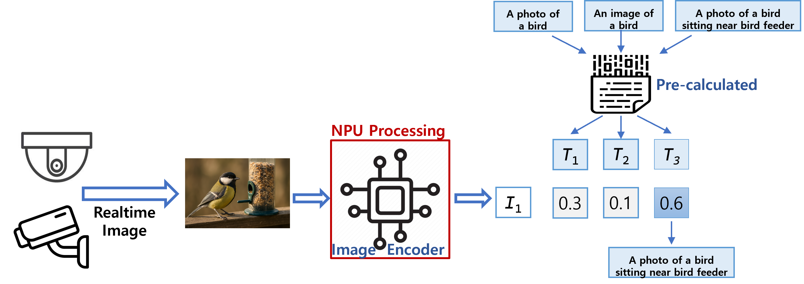
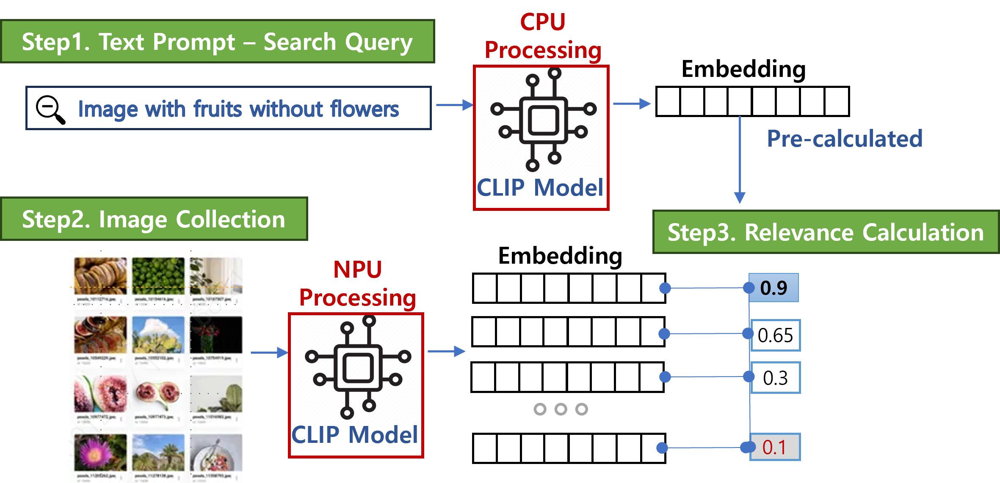
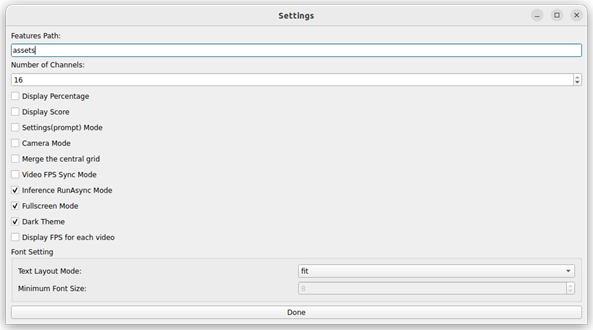

 

# Deploying CLIP Applications with DEEPX DX-M1 on Edge Devices

## DEEPX Overview

**DEEPX - Powering the Edge with Smarter AI Chips**

**DEEPX** is a leading AI semiconductor company focused on developing ultra-efficient on-device AI solutions.  
With proprietary NPUs (Neural Processing Units), **DEEPX** enables high performance, reduced power consumption, and cost efficiency across applications in smart cameras, autonomous systems, factories, smart cities, consumer electronics, and AI servers.  
**DEEPX** is moving rapidly from sample evaluation to mass production to support global deployment.

---

## DX-M1 Accelerator Overview

**DX-M1** is **DEEPX** edge AI accelerator, built with proprietary NPU architecture to deliver powerful inference with low power draw.

### Key Features

- **Exceptional Power Efficiency**: Up to 25 TOPS at only 3–5W  
- **Integrated DRAM**: High-speed internal memory for smooth multi-model execution  
- **XPU Compatibility**: Works with x86, ARM, and other mainstream CPUs  
- **Cost-Optimized Design**: Minimal SRAM footprint ensures affordability without sacrificing performance  

### Use Cases

- **Smart Camera**: Real-time edge AI analytics  
- **Edge & Storage Servers**: Compact AI compute modules  
- **Autonomous Robotics**: Embedded control and perception  
- **Industrial System**: Factory automation and monitoring  

---

## Deploying CLIP at the Edge

As multimodal AI models like CLIP (Contrastive Language–Image Pretraining) gain traction, edge deployment is becoming increasingly relevant.  
CLIP enables systems to understand the relationship between images and text, powering use cases like image captioning, visual search, and zero-shot classification.

Here are real-world applications of CLIP on edge devices, optimized for NPU (Neural Processing Unit) acceleration. The focus is on how to architect these pipelines for efficient and scalable inference at the edge.

### Image-to-Text Matching with CLIP



This figure illustrates a CLIP-based approach for generating textual descriptions from visual input.  
- An image—such as a bird near a feeder—is encoded by the NPU (image encoder of CLIP).  
- A predefined list of candidate captions is pre-encoded with the text encoder and stored.  
- Real-time images are compared against text embeddings to generate similarity scores (0–1).  
- The system applies a threshold to return the most relevant sentence.

### Text-to-Image Retrieval with CLIP



This figure shows CLIP for text-guided image retrieval.  
- User query → CPU runs text encoder  
- Candidate images → NPU runs image encoder  
- CLIP’s dual encoders distribute load across CPU (text) and NPU (image).  
- Similarity scores are computed, and the highest match is returned.

---

## DEEPX CLIP Demo: How to Set Up and Run Multimodal AI at the Edge

If you’re looking to deploy a real-time, CLIP-based visual-language application on embedded hardware, **DEEPX** has you covered.  
This guide walks you through setting up and running the **DEEPX VLM (Video-Language Model) CLIP Demo** on the **DEEPX M1** module.

### Prerequisite

1. **Clone Repository**
   ```bash
   git clone --recurse-submodules https://github.com/DEEPX-AI/dx-clip-demo.git
   ```

2. **Install Runtime and Driver**
   ```bash
   cd dx-clip-demo/dx-runtime
   ./install.sh --all
   ```

### HW & SW System Requirement

- **CPU**: aarch64, x86_64  
- **RAM**: 8GB (16GB or higher recommended)  
- **Storage**: 4GB+ available disk space  
- **OS**: Ubuntu 20.04 / 22.04 / 24.04 (x64 / aarch64)  
- **Hardware**: Must support connection to a **DEEPX M1** module via **M.2 interface**

### Installation Guide

```bash
./install.sh --app_type=pyqt
```

### Run the Demo

```bash
./run_demo.sh --app_type=pyqt
```

Demo Options:
```
1: Single Channel Demo
1-2: Single Channel Demo (Settings Mode)
1-3: Single Channel Demo (Camera Mode & Settings Mode)
2: Multi Channel Demo
2-2: Multi Channel Demo (Settings Mode)
2-3: Multi Channel Demo (Camera Mode & Settings Mode)
0: Default Demo
```

### Demo Setting UI

Configure:  
- Features Path  
- Number of Channels  
- Display Options (FPS, Dark/Light theme)  
- Font and Layout  

Click **Done** to start demo.



---

## Troubleshooting Guide

### Issue 1: `install_layout` Error

**Error**
```text
AttributeError: install_layout. Did you mean: 'install_platlib'?
```

**Solution**
```bash
python3.11 -m pip install --upgrade pip setuptools wheel
```

---

### Issue 2: `ModuleNotFoundError: No module named 'clip'`

**Solution**
```bash
cd clip_demo_rt_v295/assets/CLIP
pip install .
```

Re-run the demo afterwards.

---

### Issue 3: `Qt Plugin Error` Local and Virtualenv Path Conflict

**Solution**
```bash
unset QT_PLUGIN_PATH
unset LD_LIBRARY_PATH
```

---

## Visualization Example: Real-Time CLIP in Action


**Key Highlights**
- **Model**: CLIP (image encoder on NPU, text embeddings preloaded)  
- **Inference**: 16 channels concurrently  
- **Overlay**: Semantic text per channel, customizable layout and FPS  

Ideal for smart surveillance, industrial vision, and embedded AI.

---

## Partnership with Advantech

**DEEPX** NPUs are embedded into Advantech’s industrial PCs.  
- Ready-to-deploy Edge AI with ultra-fast, real-time processing  
- All-in-one AI platform supporting instant multi-model inference  
- Scalable and cost-effective AIoT solutions for deployment  

**Container Quick Start Guide**  
Refer to **Advantech EdgeSync Container Repository** for docker-compose and setup.
