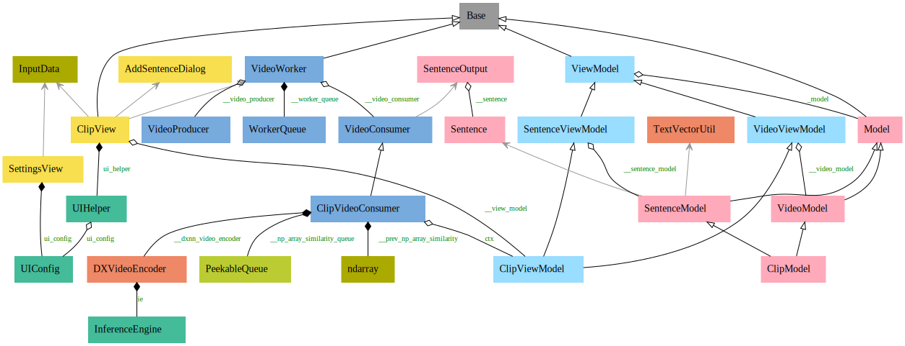

# Application Architecture

The demo app is implemented using the MVVM design pattern and the PyQt UI framework. 

## Class Diagram

The demo app is designed with the structure depicted in the above class diagram. Below is a brief description of the roles of the main classes:

- View
    - SettingsView : The initial settings screen
    - ClipView : The main screen
    - AddSentenceDialog : The dialog for adding sentences
- Model
    - VideoModel : Handles video-related data
    - SentenceModel : Handles sentence-related data
    - ClipModel : Inherits from both VideoModel and SentenceModel
- ViewModel
    - VideoViewModel : Intermediates changes in the `VideoModel`, handles requests from the `View`, and updates the `View` (in this app, most of its role is replaced by `VideoProducer`)
    - SentenceViewModel : Intermediates changes in the `SentenceModel`, handles requests from the `View`, and updates the `View` (in this app, some of its role is replaced by `ClipVideoConsumer`)
    - ClipViewModel : Inherits from both `VideoViewModel` and `SentenceViewModel`
- view.multithreading package
    - VideoProducer : Processes color conversion and resizing for video input (file or camera), generates image data for the `Worker Queue`, and sends preview videos to `ClipView`
    - VideoConsumer : Handles common tasks like FPS calculation and video source switching, delegates processing tasks to its subclass (`ClipVideoConsumer`) through the _process_impl() function
    - ClipVideoConsumer : Processes tasks delegated by the parent class (`VideoConsumer`), performs inference using a Clip model on the NPU, carries out post-processing, and sends the results
    - VideoWorker : Includes both `VideoProducer` and `VideoConsumer`, intermediating data exchange between the Producer and Consumer via the `Worker Queue`
    
## MVVM Design Pattern

### What is MVVM?
The Model-View-ViewModel (MVVM) pattern is a robust architectural design, widely acclaimed for its effectiveness in separating the development of user interfaces (UI) from the business logic and backend data models. This pattern, originating from Microsoft as a specialization of the Presentation Model design pattern, has become a mainstay in modern software development, particularly in applications with complex user interfaces and rich interaction models.

### Core Components of MVVM
MVVM consists of three primary components, each with a distinct role:

- **Model**: This is the heart of the application’s business logic. The Model represents the actual data and the rules that govern access to and updates of this data. In many cases, it mirrors the real-world entities that the application deals with. For instance, in a financial application, the Model might represent financial instruments, such as stocks or bonds.
- **View**: The View is what the user interacts with. It is the visual representation of the data from the Model. In PyQt6, the View comprises the widgets and layouts that form the user interface. Importantly, the View is devoid of any logic that handles data manipulation. Its primary role is to display information to the user and send user commands to the ViewModel.
- **ViewModel**: The ViewModel acts as an intermediary between the Model and the View. It provides an abstraction of the View that reduces the complexity of the UI logic. The ViewModel handles most of the view’s display logic and bridges the gap between the user and the Model. It listens for changes from the Model and updates the View accordingly, and it also processes commands from the View (e.g., button clicks) and translates them into actions on the Model.

### The Power of Data Binding
A key feature of MVVM is data binding, which allows for automatic synchronization of data between the Model and the View. This means that when the data in the Model changes, the View updates automatically to reflect these changes, and vice versa. This data binding is typically managed by the ViewModel, reducing the need for boilerplate code to manually update the UI every time the underlying data changes.

### Why MVVM in PyQt?
In the context of PyQt, a framework primarily used for developing desktop applications, MVVM offers a structured way to manage the complexities of UI programming. By clearly separating the business logic from the UI code, developers can create more modular, testable, and maintainable applications. This separation becomes particularly valuable in larger applications where maintaining a clear structure is essential for efficiency and collaboration.

### Benefits of Using MVVM in PyQt
The MVVM pattern offers several compelling advantages for software development, particularly in applications built with PyQt6. These benefits not only enhance the development process but also improve the overall quality and maintainability of the application:

- **Enhanced Separation of Concerns**: One of the primary benefits of MVVM is its clear division between the presentation layer (View), the data layer (Model), and the business logic (ViewModel). This separation facilitates easier management and maintenance of each component. In PyQt6 applications, this means UI designers can focus on the View without delving into the business logic, while developers can work on the ViewModel and Model without worrying about UI intricacies.
- **Improved Testability**: With business logic separated from UI code, testing becomes more straightforward. The ViewModel can be tested independently of the View, allowing for more focused unit tests. This separation is beneficial in PyQt6 applications where the UI and business logic can become complex and intertwined.
- **Increased Reusability**: Components in MVVM are more modular, making them easier to reuse across different parts of the application. For example, a ViewModel designed for a specific Model can be used with different Views, facilitating a more DRY (Don’t Repeat Yourself) approach to development. In PyQt6, this means that widgets and layouts (Views) can be reused or replaced without needing to rewrite the underlying logic.
- **Data Binding and Synchronization**: MVVM naturally supports data binding, ensuring that the UI stays in sync with the underlying data model. Changes in the Model are automatically reflected in the View, and user interactions in the View can be easily propagated back to the Model via the ViewModel. This dynamic data flow is especially beneficial in PyQt6 applications with real-time data updates or complex user interactions.
- **Adaptability and Scalability**: The decoupled nature of MVVM makes it easier to adapt and scale applications. Changing business requirements or UI redesigns can be implemented with minimal impact on the other components of the application. In PyQt6, this means that as applications grow or evolve, the underlying architecture remains robust and adaptable.
- **Improved Collaboration**: MVVM supports better collaboration between developers and designers. Since the View and ViewModel are separate, UI designers can work on the View using tools like Qt Designer, while developers focus on the ViewModel and Model, leading to a more efficient development process.
- **Simplified Maintenance**: In the long run, applications built with the MVVM pattern are easier to maintain and update. The clear structure and separation make it easier to identify and fix issues, add new features, or refactor parts of the application.

