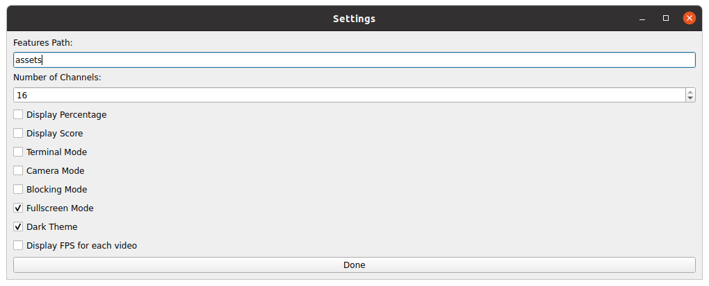

# Settings View



The demo app provides a `Settings View` where specific features offered by the app can be toggled ON/OFF, and configuration values for these features can be modified.

## Setting options
1. **Assets Path**:
    - You can change the assets directory path.
2. **Number of Channels (Single/Multi-channel Mode)**:
    - You can switch from a single channel to up to 16 channels by adjusting the `Number of Channels` setting.
3. **Display Percentage**:
    - Set whether to display the percentage of the similarity value for the matching sentence.
4. **Display Score**:
    - Set whether to display the score of the similarity value for the matching sentence.
5. **Settings Mode**:
    - Enable or disable the input Settings UI, where you can add, delete, or clear all sentences.
6. **Camera Mode**:
    - **Single-channel Mode**: Enable the camera mode to replace the video with the one from the device-connected camera.
    - **Multi-channel Mode**: Enable the camera mode to add the video from the device-connected camera to the channels.
7. **Merge the central grid**:
    - In video grid screens such as 3x3 and 4x4, merge multiple grids in the center into one larger display.
    - Previous videos playing in the merged grid are redistributed to the channels in other grids.
    - **Camera Mode: ON**: The camera video plays in the merged central grid.
    - **Camera Mode: OFF**: All sample videos (16 total) are played in a loop in the merged central grid.
8. **Video FPS Sync Mode**:
    - **ON**: Check the original fps information of the video and force the input to be processed at the original fps speed of the video.
    - **OFF**: Process video input at the maximum speed available on the hardware. (However, if Camera Mode is ON, input is processed at the original video fps speed.)
9. **Fullscreen Mode**:
    - Set the app to fullscreen mode or windowed mode.
10. **Dark Theme**:
    - Set whether to apply the dark theme.
11. **Display FPS for each video**:
    - In Multi-channel mode, you can set whether to display the current FPS for each channel.

## Default Settings Options

The default values configured in the `Settings View` are defined as follows in `clip_demo_app_pyqt/common/config/ui_config.py`.

```python
class UIConfig:
   # Settings View
   num_channels = 16
   settings_mode = 0
   merge_central_grid = 0
   camera_mode = 0

   show_percent = False
   show_score = False
   show_each_fps_label = False
   fullscreen_mode = True
   dark_theme = True
```
