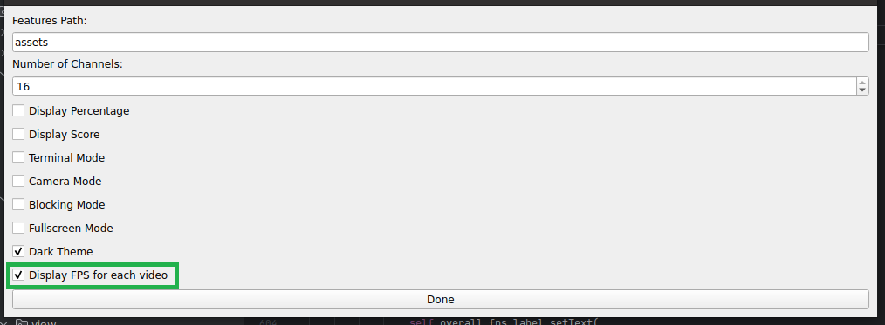
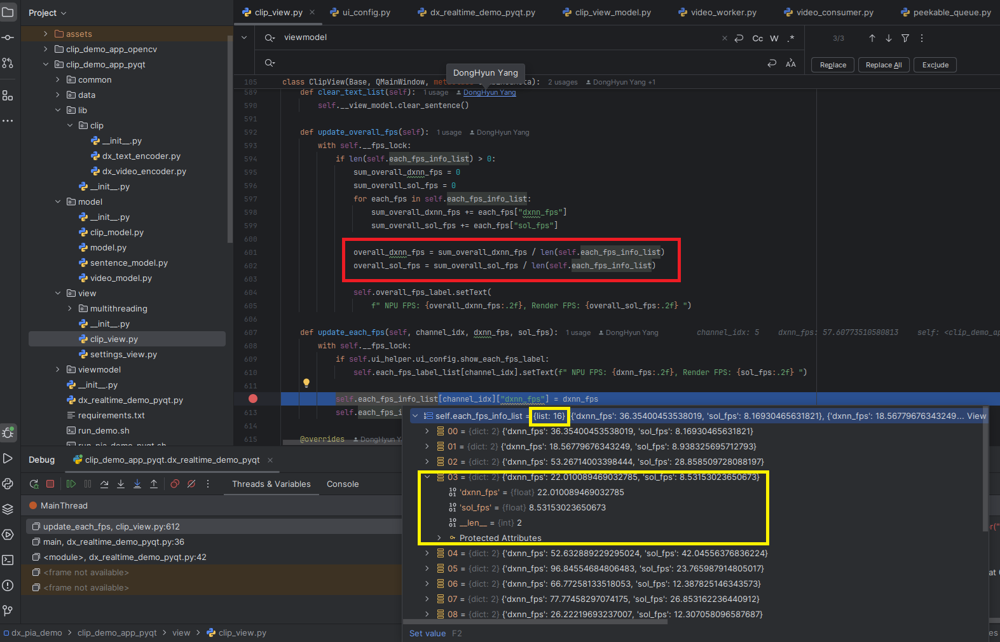
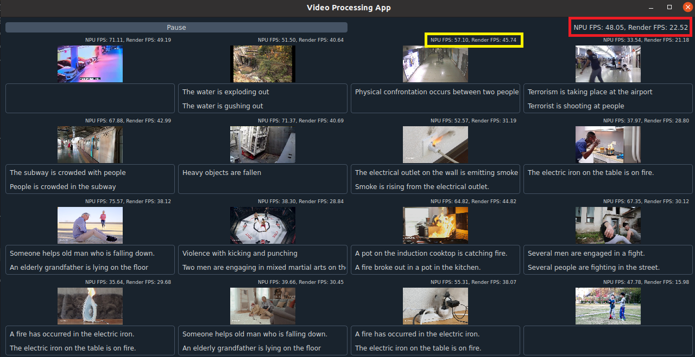
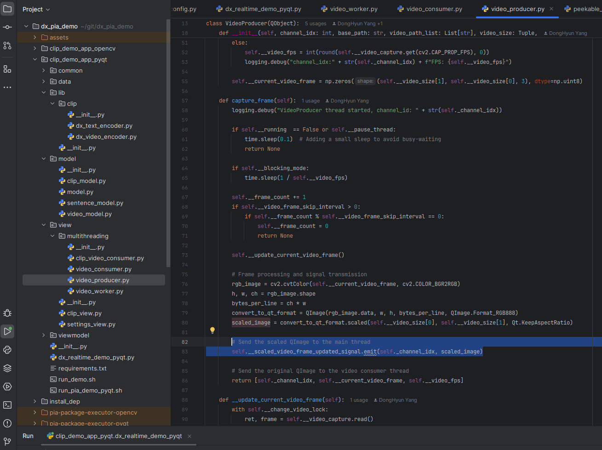

# About the FPS

## How to Check Individual Video FPS Information and the Arithmetic Mean FPS Information

### Individual Video FPS
By enabling the `Display FPS for each video` checkbox in the `Settings` window (highlighted in green in the capture image), the `NPU FPS` and `APP FPS` (calculated as the number of frames that can be processed in one second based on the time taken per frame) will be displayed in real time for each channel.

### Arithmetic Mean FPS
The relevant code is in the `clip_demo_app_pyqt/view/clip_view.py` file within the `update_overall_fps()` and `update_each_fps()` functions.

- The yellow box shows the FPS information for each channel, where `self.each_fps_info_list` contains 16 objects, and each object holds the `dxnn_fps` (NPU FPS) and `sol_fps` (APP FPS) information.
- The red box represents the sum of the FPS information from all channels divided by the number of channels, providing the average FPS value.

### Difference Between NPU FPS and App FPS

- **NPU FPS Calculation Criteria**
    - Time taken for color conversion of the video frame (YUV to RGB)
    - Time taken for inference of the video frame on the NPU

- **App FPS Calculation Criteria**
    - Time taken for color conversion of the video frame (YUV to RGB)
    - Time taken for inference of the video frame on the NPU
    - Time taken to calculate the similarity between the results of the NPU inference (image embedding generation) and the registered sentences (text embeddings), and to determine whether the calculated score exceeds the threshold for each sentence. If it does, a signal is sent to output the sentence.

Additionally, the `VideoProducer` converts and resizes the video into QImage format, which is then sent to `ClipView`. The PyQt framework renders this using a grid UI, and these operations are also processed in parallel on a separate thread. It is important to consider that these tasks can also impact both NPU FPS and App FPS, so the FPS figures should be referenced with this in mind.

*Note: The relevant code is in the `clip_demo_app_pyqt/view/multithreading/video_producer.py` file, specifically in the `capture_frame()` function, where `scaled_image` is created and emitted to be passed to the main thread (`ClipView`) for rendering.*

