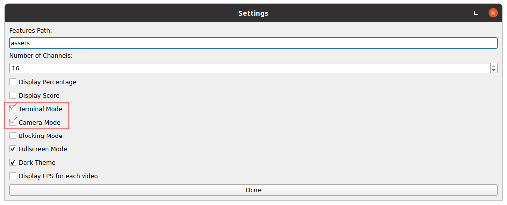
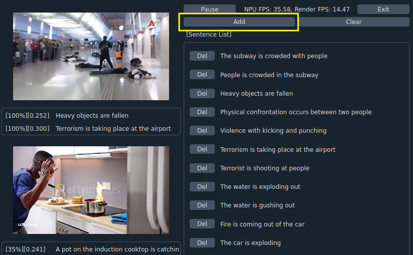
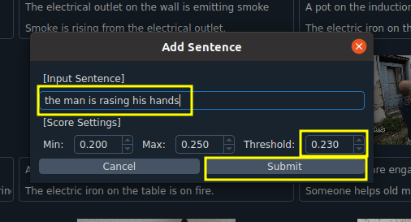

# How to Run the "Prompting Sentence on Real-time Video" demo

## (Prerequisite)
Connect the webcam to the device.

## Steps
1. Run `./run_clip_demo.sh` and select options 2-3.  
2. In the `Settings` window, ensure the checkboxes for `Settings(prompt) Mode` and `Camera Mode` are checked, then click the `Done` button.
    - 
3. Confirm the webcam video in the last channel.  
4. Click the `Add button` in the right(Settings) UI panel 
    - 
5. In the `Add Sentence` dialog, enter the sentence along with the min, max, and threshold values, then click `Submit button`.
    - 
6. Check that the sentence has been added to the `[Sentence List]` in the right UI panel 
7. Perform the relevant action in front of the webcam 
8. Confirm that the corresponding sentence is displayed for the action.  

