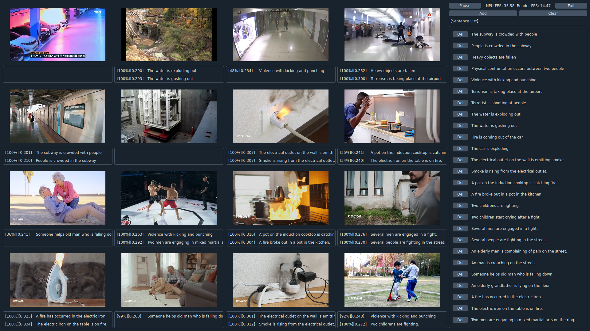

# Clip Demo APP (PyQT)

The `Clip Demo APP` is a sample application that uses the `DEEPX NPU` to leverage the Contrastive Language-Image Pre-training model (`CLIP model`) for inferring the similarity between video and text. It detects specific situations occurring in the video and displays an alarm when detected.

## Overview

The Clip Demo App calculates the similarity score between the image embedding results of video frames from each input channel and the text embedding results of registered sentences. If the score exceeds a predefined threshold, the corresponding sentence is displayed as an alarm.

- The embedding generation for videos (images) is performed using the `DEEPX NPU`. 
- Since the embedding generation for images is repeated across multiple video frames, it significantly impacts the overall speed of the app, necessitating the use of the NPU.
- The embedding generation for text is performed only once during the app's execution, thus having a minimal impact on the overall speed of the app, and is generated using the CPU (or GPU) instead of the NPU. 

## Key Features
- Single-Channel Demo
    - Detects similarities between a single-channel video (image) and registered sentences (text) and displays alarms accordingly.
- Multi-Channel Demo
    - Detects similarities between 2 to 16-channel videos (images) and registered sentences (text) and displays alarms accordingly.
- Realtime (Camera Mode) Demo
    - Supports real-time camera input for video.
- Settings (Prompt Mode) Demo
    - Supports the addition and deletion of real-time sentence inputs.
